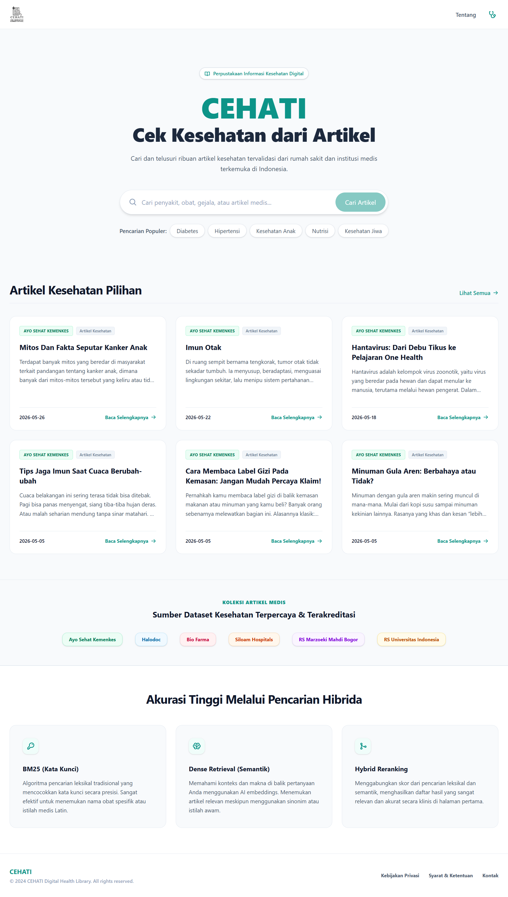
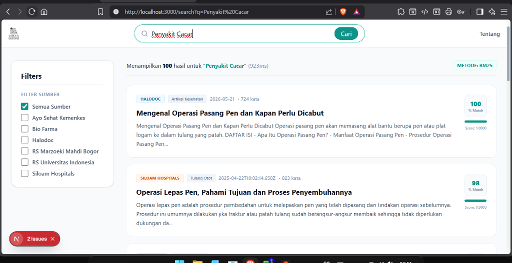
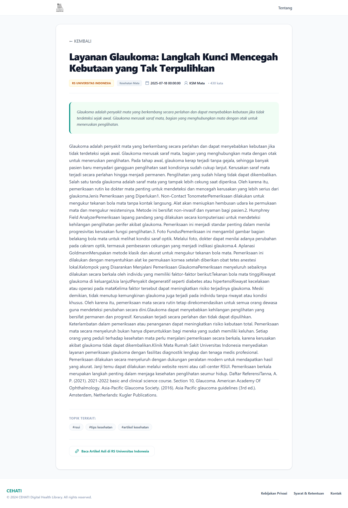
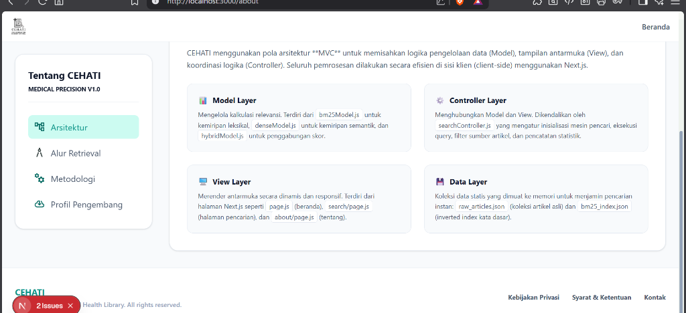

<div align="center">

# CEHATI Medical Search Engine

**Cek Kesehatan dari Artikel**

**Academic Project · Information Retrieval · Medical Search**


</div>

## Ringkasan

**CEHATI** adalah aplikasi temu kembali informasi berbasis web untuk membantu pengguna mencari artikel kesehatan berbahasa Indonesia. Sistem menggabungkan pencarian leksikal menggunakan **Okapi BM25** dan pencarian semantik menggunakan **sentence embeddings**.

Project ini dikembangkan sebagai tugas akhir Mata Kuliah **Temu Kembali Informasi** pada Program Studi Teknik Informatika, Universitas Trunojoyo Madura.

> CEHATI is an academic medical information retrieval project that combines BM25 and semantic search to rank Indonesian health articles more contextually.

## Permasalahan yang Diangkat

Pencarian berbasis kata kunci sering gagal menemukan artikel yang relevan ketika pengguna memakai istilah awam, singkatan, atau kata yang berbeda dari istilah medis pada dokumen. CEHATI mencoba mengurangi masalah tersebut dengan menggabungkan dua pendekatan:

- **BM25** untuk pencocokan kata kunci yang presisi.
- **Dense retrieval** untuk memahami kemiripan konteks dan makna.
- **Hybrid scoring** untuk menyatukan hasil kedua metode dalam satu peringkat.

## Kontribusi Saya

- Merancang alur pencarian dan pengalaman pengguna.
- Mengimplementasikan indexing serta retrieval berbasis BM25.
- Mengintegrasikan sentence embeddings untuk pencarian semantik.
- Menyusun hybrid scoring dan tampilan skor relevansi.
- Mengembangkan antarmuka pencarian, hasil, detail artikel, serta halaman metodologi.
- Menyiapkan dokumentasi teknis dan deployment aplikasi.

## Fitur Utama

- Pencarian artikel kesehatan berbahasa Indonesia.
- Pilihan metode retrieval BM25, Dense, dan Hybrid.
- Persentase kecocokan serta skor relevansi pada hasil pencarian.
- Filter artikel berdasarkan sumber.
- Halaman detail artikel dengan metadata dan konten lengkap.
- Ringkasan metodologi serta arsitektur sistem.
- Antarmuka responsif untuk desktop dan perangkat seluler.

## Teknologi

| Bagian | Teknologi |
|---|---|
| Web Framework | Next.js |
| Lexical Retrieval | Okapi BM25 |
| Text Processing | Sastrawi |
| Semantic Retrieval | Sentence Transformers |
| Embedding Model | `paraphrase-multilingual-MiniLM-L12-v2` |
| Similarity | Cosine Similarity |
| Model Service | Hugging Face API |
| Deployment | Vercel |

## Metode Hybrid Retrieval

CEHATI menggabungkan skor BM25 dan dense retrieval setelah kedua skor dinormalisasi.

```text
Hybrid Score = 0.4 × Normalized BM25 Score
             + 0.6 × Normalized Dense Score
```

Bobot dense retrieval dibuat lebih besar untuk membantu pencarian yang memakai sinonim atau istilah awam. Nilai tersebut merupakan konfigurasi eksperimen project dan dapat disesuaikan kembali untuk evaluasi lanjutan.

### Lexical Retrieval

- Algoritma: Okapi BM25.
- Parameter: `k1 = 1.2` dan `b = 0.75`.
- Preprocessing: stemming Bahasa Indonesia menggunakan Sastrawi.
- Prefix matching hanya diterapkan pada kueri dengan panjang minimum tertentu untuk mengurangi pencocokan token yang terlalu pendek.

### Semantic Retrieval

- Model: `sentence-transformers/paraphrase-multilingual-MiniLM-L12-v2`.
- Dimensi embedding: 384.
- Perhitungan kemiripan: cosine similarity.
- Query embedding diproses melalui server-side API route Next.js.

## Dataset Artikel

Dataset project mengindeks artikel dari sejumlah sumber kesehatan Indonesia, antara lain:

- Ayo Sehat Kementerian Kesehatan
- Halodoc
- Bio Farma
- Siloam Hospitals
- RS Marzoeki Mahdi Bogor
- RS Universitas Indonesia

Sumber asli tetap dicantumkan pada halaman detail artikel. Dataset digunakan untuk simulasi dan evaluasi sistem temu kembali informasi dalam konteks akademik.

## Dokumentasi Antarmuka

### Halaman Utama



### Hasil Pencarian



### Detail Artikel



### Metodologi dan Arsitektur



## Menjalankan Project

### Prasyarat

- Node.js 18 atau versi lebih baru.
- npm.

### Instalasi

```bash
git clone https://github.com/ZekkCode/cehati-web-search-engine.git
cd cehati-web-search-engine
npm install
npm run dev
```

Buka aplikasi melalui:

```text
http://localhost:3000
```

### Production Build

```bash
npm run build
npm run start
```

## Environment Variable

Token Hugging Face bersifat opsional, tetapi disarankan untuk mengurangi keterbatasan pemakaian API publik.

```env
HF_API_KEY=your_hugging_face_token
```

Jangan menyimpan token asli di dalam repository.

## Konteks Akademik

- **Mata Kuliah:** Temu Kembali Informasi
- **Program Studi:** Teknik Informatika
- **Universitas:** Universitas Trunojoyo Madura
- **Pengembang:** Zakaria Mujur Prasetyo

## Medical Disclaimer

CEHATI merupakan simulasi sistem temu kembali informasi untuk kebutuhan akademik. Informasi yang ditampilkan tidak boleh digunakan sebagai pengganti diagnosis, terapi, atau saran dari tenaga medis profesional.
