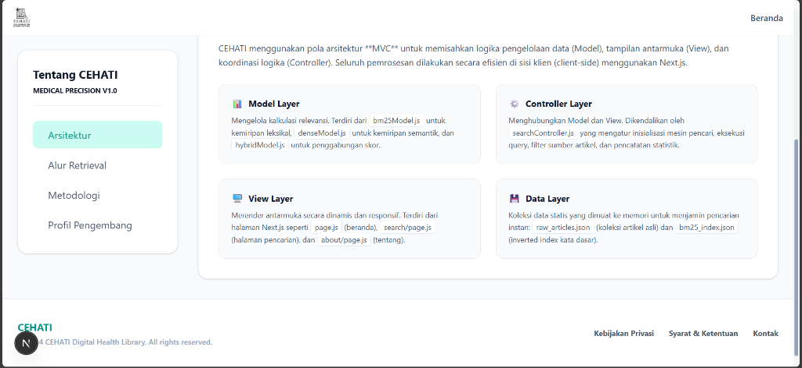

# 🏥 CEHATI - Cek Kesehatan dari Artikel (Medical Search Engine)

CEHATI (Cek Kesehatan dari Artikel) adalah sistem temu kembali informasi (Information Retrieval) berbasis web dengan presisi tinggi yang didesain khusus untuk domain medis berbahasa Indonesia. Aplikasi ini dikembangkan sebagai pemenuhan Tugas Akhir / Ujian Akhir Semester (UAS) matakuliah **Temu Kembali Informasi**.

Sistem ini memadukan **Pencarian Leksikal (Okapi BM25)** dan **Pencarian Semantik (Dense Retrieval)** secara hibrida (**Hybrid Scoring**) untuk menghasilkan perangkingan artikel yang sangat akurat secara klinis dan kebahasaan.

---

## 👤 Profil Pengembang

* **Nama Lengkap**: Zakaria Mujur Prasetyo  
* **NIM**: 240411100144  
* **Program Studi**: Teknik Informatika  
* **Instansi**: Universitas Trunojoyo Madura  
* **Kontak**: [zakariamujur6@gmail.com](mailto:zakariamujur6@gmail.com)  
* **Website**: [zekktech.biz.id](https://zekktech.biz.id)  
* **Repositori GitHub**: [cehati-web-search-engine](https://github.com/ZekkCode/cehati-web-search-engine.git)  

---

## 🛠️ Metodologi Penilaian & Pencarian (Hybrid Scoring)

CEHATI menerapkan formula penataan skor hibrida (**Hybrid Reranking**) yang menggabungkan kekuatan pencocokan kata kunci presisi dan pemahaman konteks semantik:

$$\text{Hybrid Score} = w_{\text{BM25}} \times \text{Normalize}(\text{Score}_{\text{BM25}}) + w_{\text{Dense}} \times \text{Normalize}(\text{Score}_{\text{Dense}})$$

Dengan pembobotan default:
* **Bobot BM25 ($w_{\text{BM25}}$)**: `0.4`
* **Bobot Dense ($w_{\text{Dense}}$)**: `0.6` (diberi porsi lebih besar karena pencarian medis diuntungkan oleh pemahaman sinonim awam/medis).

### 1. Skor Leksikal BM25 (Inverted Index)
* **Kalkulasi**: Okapi BM25 dengan parameter UAS yang terkalibrasi secara ketat:
  * $k_1 = 1.2$ (Saturasi frekuensi istilah)
  * $b = 0.75$ (Penalti panjang dokumen)
* **Pra-pemrosesan Teks**: Menggunakan stemming Bahasa Indonesia Sastrawi pada tahap indeksasi.
* **Partial Prefix Match**: Mendukung pencocokan parsial tingkat lanjut pada kueri yang tidak di-stem secara lokal dengan validasi panjang kueri minimum $\ge 3$ huruf (`qTerm.length >= 3 && dt.startsWith(qTerm)`) untuk mencegah kecocokan salah pada token yang terlalu pendek (seperti kata `"penyakit"` secara keliru mencocokkan kata medis `"pen"` / pen bedah tulang).

### 2. Kemiripan Dense Semantik (Sentence Embeddings)
* **Model Representasi**: Vektor embedding 384-dimensi menggunakan model Transformer multibahasa Hugging Face: `sentence-transformers/paraphrase-multilingual-MiniLM-L12-v2`.
* **Kalkulasi Kemiripan**: *Cosine Similarity* (dihitung secara dot product karena vektor embeddings dokumen telah dinormalisasi L2).
* **Adblock-Proof Proxy**: Request embedding query dilewatkan melalui Server-Side API Route Next.js (`/api/encode`) untuk mencegah pemblokiran dari ekstensi browser/adblocker yang membatasi panggilan client langsung ke API Hugging Face.

---

## 📂 Dataset Medis Terpercaya
Dataset yang digunakan berisi artikel kesehatan berlisensi dan tervalidasi yang diindeks dari berbagai rumah sakit dan portal kesehatan terkemuka di Indonesia:
* Ayo Sehat Kemenkes
* Halodoc
* Bio Farma
* Siloam Hospitals
* RS Marzoeki Mahdi Bogor
* RS Universitas Indonesia

> [!NOTE]
> **Kriteria Panjang Teks**: Sesuai dengan instruksi UAS, dataset ini memuat teks artikel panjang (judul + konten penuh) dengan **panjang rata-rata di atas 900 kata** per dokumen untuk menjamin evaluasi similarity berbasis vektor yang bermakna.

---

## 💻 Panduan Instalasi & Penggunaan Lokal

### Prasyarat (Prerequisites)
Pastikan komputer Anda sudah terinstal:
* [Node.js](https://nodejs.org/) (versi 18.x atau lebih baru)
* npm (biasanya terinstal bersama Node.js)

### Langkah Langkah Instalasi

1. **Clone Repositori**:
   ```bash
   git clone https://github.com/ZekkCode/cehati-web-search-engine.git
   cd cehati-web-search-engine
   ```

2. **Instal Dependensi**:
   ```bash
   npm install
   ```

3. **Jalankan Mode Pengembangan (Local Dev)**:
   ```bash
   npm run dev
   ```
   Buka peramban Anda dan akses [http://localhost:3000](http://localhost:3000).

4. **Kompilasi Produksi (Build & Start)**:
   ```bash
   npm run build
   ```
   Setelah kompilasi selesai dengan sukses, jalankan server produksi lokal:
   ```bash
   npm run start
   ```

---

## 🚀 Panduan Deployment ke Vercel

Aplikasi Next.js CEHATI telah diuji kompilasinya dan 100% kompatibel dengan infrastruktur Vercel.

1. **Push Proyek ke GitHub**:
   Pastikan Anda telah mengunggah semua berkas proyek ke repositori GitHub Anda.
2. **Impor Proyek**:
   * Masuk ke dashboard [Vercel](https://vercel.com).
   * Klik **"Add New"** > **"Project"** dan pilih repositori `cehati-web-search-engine`.
3. **Konfigurasi Environment Variables (Opsional)**:
   Untuk mencegah limitasi rate pencarian dari API publik Hugging Face:
   * Buka tab **Environment Variables** di layar setup Vercel.
   * Tambahkan key `HF_API_KEY` dan masukkan token API Hugging Face Anda.
4. **Klik "Deploy"**:
   Tunggu hingga Vercel menyelesaikan kompilasi statik dan dinamis. Aplikasi web Anda langsung siap digunakan!

---

## 📜 Medical Disclaimer (Penafian Medis)
Informasi hasil pencarian di dalam CEHATI murni ditujukan untuk tujuan simulasi sistem temu kembali informasi akademik. Hasil pencarian tidak boleh digunakan sebagai pengganti diagnosis medis, terapi medis, atau saran profesional dari dokter. Harap berkonsultasi dengan dokter atau rumah sakit terdekat untuk masalah kesehatan nyata Anda.

---

## 📸 Dokumentasi Antarmuka (Screenshots)

Berikut adalah beberapa tangkapan layar dari tampilan antarmuka sistem mesin pencari CEHATI yang diakses secara lokal:

### 1. Halaman Beranda (Homepage)
Menampilkan kolom pencarian hibrida, topik populer, statistik database, dan ringkasan teknologi pencarian.


### 2. Halaman Hasil Pencarian (Search Results)
Menampilkan daftar artikel kesehatan yang relevan, persentase kecocokan (% Match), skor relevansi desimal, label metode retrieval yang aktif (BM25/Dense/Hybrid), dan filter dinamis berdasarkan sumber artikel.


### 3. Halaman Detail Artikel (Article Detail)
Menampilkan judul artikel lengkap, metadata artikel (sumber penerbit, tanggal rilis, penulis, jumlah kata), kotak ringkasan klinis, konten artikel lengkap, tag topik terkait, serta tombol rujukan untuk membaca artikel asli pada situs penerbit asal.


### 4. Halaman Tentang (About)
Menampilkan informasi mendalam mengenai arsitektur sistem berbasis MVC, diagram alur retrieval indeksasi data, parameter metodologi penilaian (BM25 dan Dense), serta profil lengkap pengembang sistem.


### 5. Halaman Kontak Pengembang (Contact)
Menampilkan profil lengkap pengembang, NIM mahasiswa, instansi Universitas Trunojoyo Madura, serta tautan pintas ke media sosial dan portofolio resmi pengembang.


